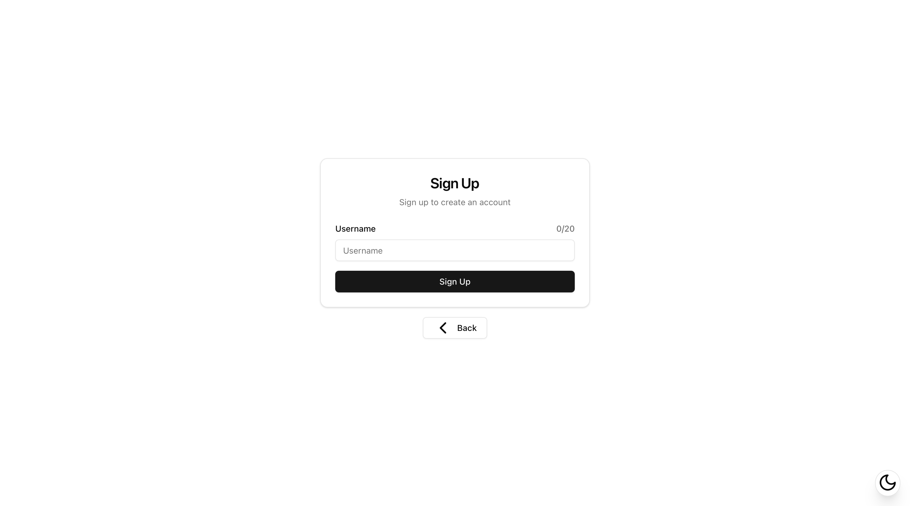
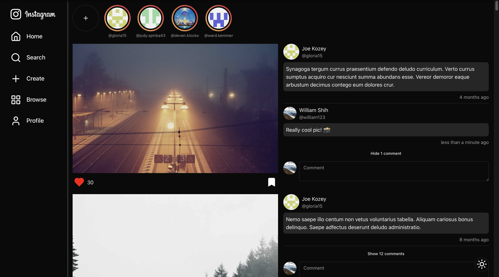
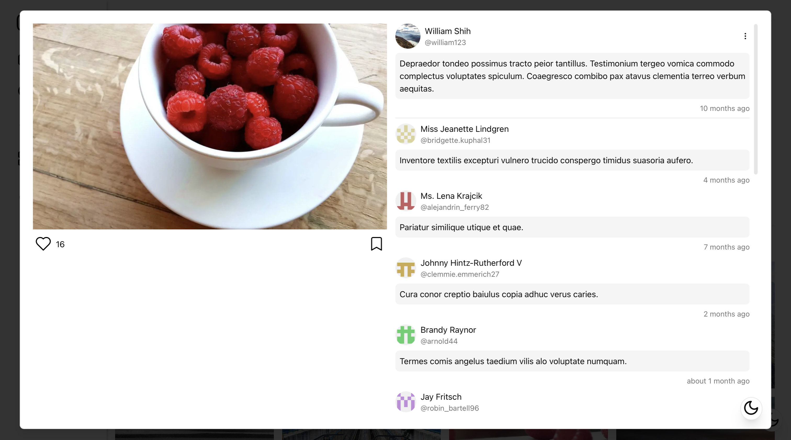
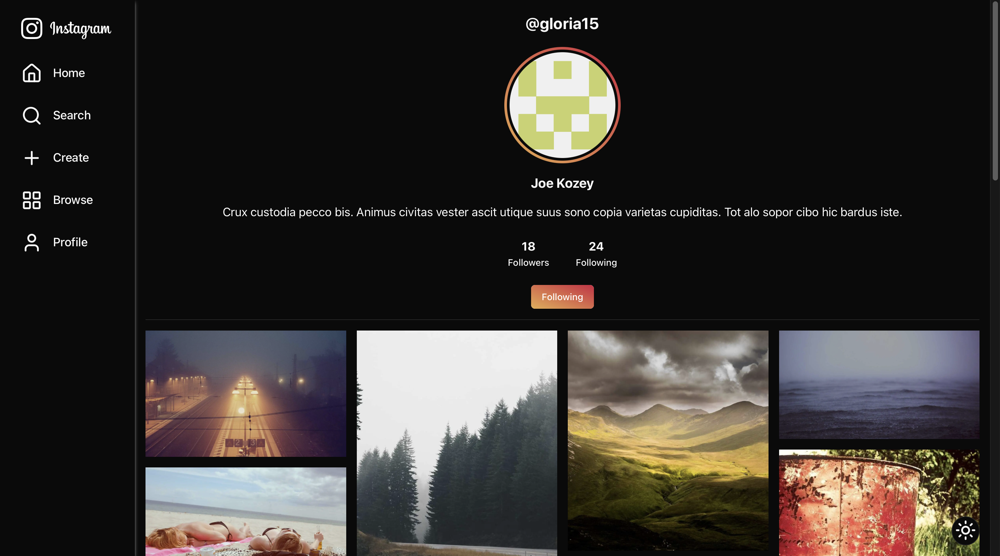
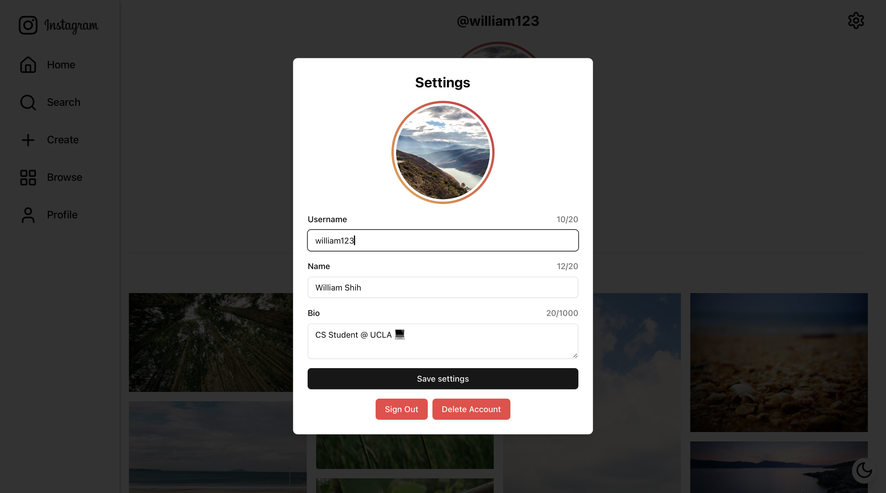
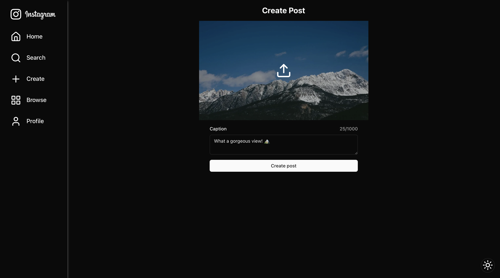
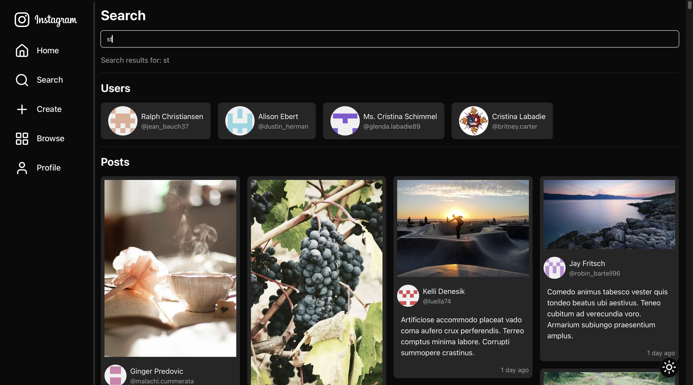
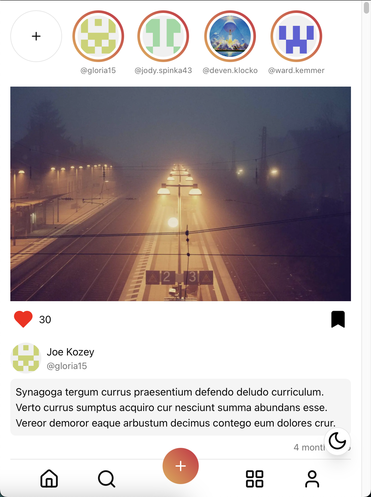

# Instagram Clone

A full-stack Instagram clone built with Next.js 14, React, TypeScript, and MongoDB. Features real-time updates, file uploads, authentication, and a responsive design.

## 📸 Screenshots

### Sign Up



### Home Feed



### Post Modal



### User Profile



### Edit Profile



### Create Post



### Browse


### Search



### Mobile



## 🌟 Features

### Authentication & Users

- Email authentication with Auth.js
- Custom user profiles
- Follow/unfollow functionality
- Profile customization

### Posts & Interactions

- Image upload and sharing
- Like and bookmark posts
- Comment on posts
- Real-time updates with optimistic UI
- Masonry grid layout for posts

### UI/UX

- Responsive design (mobile-first)
- Dark/light mode
- Loading states and skeletons
- Toast notifications

## 🛠 Tech Stack

### Frontend

- Next.js 14
- React
- TypeScript
- TailwindCSS
- Shadcn UI
- React Query (TanStack Query)
- React Hook Form
- Zod validation

### Backend

- Next.js API routes
- Prisma ORM
- MongoDB
- Auth.js (NextAuth)

### Infrastructure

- Vercel deployment
- Pinata (IPFS) for image storage
- MongoDB Atlas

## 📦 Installation

1. Clone the repository:

```bash
git clone https://github.com/williamzshih/instagram.git
cd instagram
```

2. Install dependencies:

```bash
npm install
yarn install
pnpm install
bun install
```

3. Set up environment variables:

```bash
AUTH_SECRET="from_authjs"
AUTH_GOOGLE_ID="from_google"
AUTH_GOOGLE_SECRET="from_google"
DATABASE_URL="from_mongodb"
PINATA_JWT="from_pinata"
NEXT_PUBLIC_GATEWAY_URL="from_pinata"
PINATA_GROUP_ID="from_pinata"
```

4. Run the development server:

```bash
npm run dev
yarn dev
pnpm dev
bun dev
```

## 🔑 Key Components

### Database Schema

```prisma
model User {
  id        String     @id @default(auto()) @map("_id") @db.ObjectId
  email     String     @unique
  username  String     @unique
  name      String
  bio       String     @default("")
  avatar    String     @default("https://upload.wikimedia.org/wikipedia/commons/2/2c/Default_pfp.svg")
  posts     Post[]
  comments  Comment[]
  likes     Like[]
  bookmarks Bookmark[]
  followers Follow[]   @relation("followers")
  following Follow[]   @relation("following")
  createdAt DateTime   @default(now())
}

model Post {
  id        String     @id @default(auto()) @map("_id") @db.ObjectId
  email     String
  user      User       @relation(fields: [email], references: [email], onDelete: Cascade)
  image     String
  caption   String     @default("")
  comments  Comment[]
  likes     Like[]
  bookmarks Bookmark[]
  createdAt DateTime   @default(now())
}

model Comment {
  id        String   @id @default(auto()) @map("_id") @db.ObjectId
  email     String
  user      User     @relation(fields: [email], references: [email])
  postId    String   @db.ObjectId
  post      Post     @relation(fields: [postId], references: [id], onDelete: Cascade)
  comment   String
  createdAt DateTime @default(now())
}

model Like {
  id     String @id @default(auto()) @map("_id") @db.ObjectId
  email  String
  user   User   @relation(fields: [email], references: [email])
  postId String @db.ObjectId
  post   Post   @relation(fields: [postId], references: [id], onDelete: Cascade)

  @@unique([email, postId])
}

model Bookmark {
  id     String @id @default(auto()) @map("_id") @db.ObjectId
  email  String
  user   User   @relation(fields: [email], references: [email])
  postId String @db.ObjectId
  post   Post   @relation(fields: [postId], references: [id], onDelete: Cascade)

  @@unique([email, postId])
}

model Follow {
  id                String @id @default(auto()) @map("_id") @db.ObjectId
  email             String
  user              User   @relation("following", fields: [email], references: [email], onDelete: Cascade)
  followingUsername String
  following         User   @relation("followers", fields: [followingUsername], references: [username], onDelete: Cascade)

  @@unique([email, followingUsername])
}
```

## 💡 Key Features Implementation

### Real-time Updates

- Optimistic updates using React Query
- Automatic cache invalidation
- Seamless user experience

### Image Upload Flow

1. User selects image
2. File uploaded to Pinata (IPFS)
3. File CID and URL stored in MongoDB

### Authentication System

- Email authentication
- Protected routes
- Persistent sessions
- Secure user management

## 🎯 Future Improvements

- Direct messaging
- Stories functionality
- Image filters
- Performance optimizations
- Auth.js and Prisma integration

## 👤 Author

William Shih

- GitHub: [@williamzshih](https://github.com/williamzshih)
- LinkedIn: [@williamzshih](https://www.linkedin.com/in/williamzshih/)
