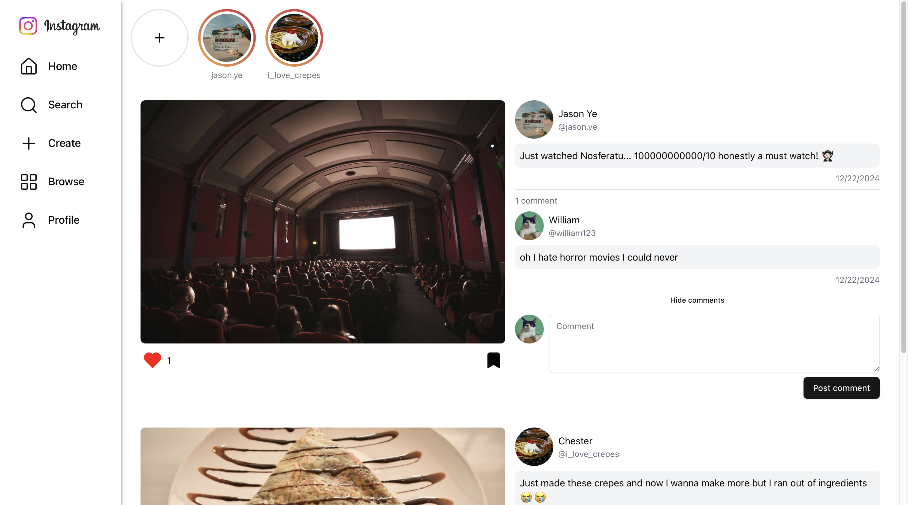
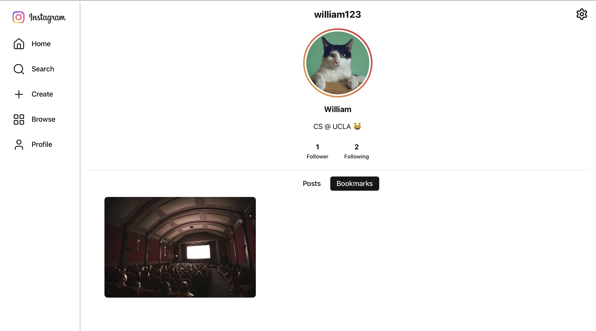

# Instagram Clone

A full-stack Instagram clone built in one week using Next.js 14, featuring real-time interactions, image uploads, and a responsive design.

## 🚀 Features

- **Authentication**
  - Google OAuth sign-in
  - Protected routes
  - Session management

- **Posts**
  - Create posts with images and captions
  - Like and bookmark posts
  - Comment on posts
  - View posts in grid or modal

- **User Profiles**
  - Customizable avatar, name, and bio
  - Follow/unfollow users
  - View user's public posts
  - Private bookmarks (visible only to the user)
  - Following/Followers lists

- **Search**
  - Search users and posts
  - Debounced search input
  - Real-time results

- **UI/UX**
  - Responsive design (mobile + desktop)
  - Optimistic updates for instant feedback
  - Loading states and error handling
  - Toast notifications

## 💻 Tech Stack

- **Frontend**
  - Next.js 14 (App Router)
  - React
  - TailwindCSS
  - shadcn/ui components
  - TanStack Query

- **Backend**
  - Next.js API routes
  - Prisma ORM
  - MongoDB
  - Auth.js
  - Pinata (file storage)

## 📸 Screenshots

### Home Feed

*Main feed showing posts, stories, and interactions*

### Profile Page

*User profile with posts grid and account information*

### Post Detail

*Detailed post view with comments and interactions*

### Mobile Experience

*Responsive design for mobile devices*

## 🛠️ Installation

1. Clone the repository

```bash
git clone https://github.com/williamzshih/instagram.git
```

2. Install dependencies
```bash
npm install
# or
yarn install
# or
pnpm install
# or
bun install
```

3. Set up environment variables
```env
AUTH_SECRET=authjs_secret
AUTH_GOOGLE_ID=google_client_id
AUTH_GOOGLE_SECRET=google_client_secret
DATABASE_URL=mongodb_url
PINATA_JWT=pinata_jwt
NEXT_PUBLIC_GATEWAY_URL=pinata_gateway_url
PINATA_GROUP_ID=pinata_group_id
```

4. Run the development server
```bash
npm run dev
# or
yarn dev
# or
pnpm dev
# or
bun dev
```

Open [http://localhost:3000](http://localhost:3000) with your browser to see the result.

## 📚 Learning Outcomes

- Implemented full-stack features with Next.js 14
- Learned database modeling with Prisma and MongoDB
- Managed complex state with TanStack Query
- Handled file uploads with Pinata
- Built responsive UI with TailwindCSS
- Implemented real-time updates with optimistic UI
- Created protected routes with Auth.js

## 🔮 Future Improvements

While the core features are complete, potential improvements could include:
- Real-time notifications
- Direct messaging
- Stories functionality
- Image filters
